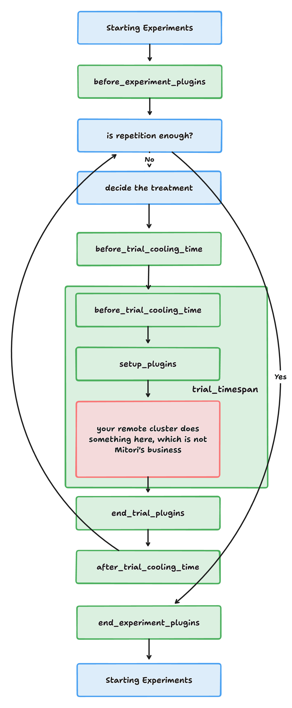

# 🍃 Midori

Midori is an orchestrator that allows researchers to run software engineering experiments on remote clusters. It is designed to be automated for time-consuming experiments that require a large number of runs.

## 🧱 Architectural

- **Why Midori?** Because there are so many things to consider when it comes to running software engineering experiments, such as:
  - Cooling down before each trial.
  - SSH Connection.
  - Randomizing the order of the trials.
  - Switching between different treatments.
  - ...
- **What is an orchestrator?** Mitori is meant to be a local tool that manipulates the remote cluster to run the experiments using SSH. In this way, the overhead of the experiment on the remote cluster is minimized.

<div align="center">
  
</div>

## 🚀 Getting Started

### Installation

`pip install midori`

### Usage

Initialize the orchestrator with the following parameters and run:

```python
from midori.core import Orchestrator

orchestrator = Orchestrator(
  hostname: str,
  username: str,
  password: str,
  repetitions: int,
  before_trial_cooling_time: int,
  trial_timespan: int,
  after_trial_cooling_time: int,
  variables: Dict[str, List[str]],
  subject_path: str,
  before_experiment_plugins: List[Type[PluginHelper]] = [],
  setup_plugins: List[Type[PluginHelper]] = [],
  end_trial_plugins: List[Type[PluginHelper]] = [],
  end_experiment_plugins: List[Type[PluginHelper]] = [],
)

orchestrator.run()
```

### Parameters

- `hostname`, `username`, `password`: Mitori needs these parameters to connect to the remote cluster via SSH.
- `repetitions`: The number of repetitions for the experiment.
- `before_trial_cooling_time`: The cooling time before each trial, in seconds.
- `trial_timespan`: The time span of each trial, in seconds.
- `after_trial_cooling_time`: The cooling time after each trial, in seconds.
- `variables`: The variables to be manipulated in the experiment. For example, if you have two variables, `x` and `y`, and you want to run the experiment with the values of `x` as `[1, 2, 3]` and the values of `y` as `[4, 5, 6]`, you can define the variables as `{'x': [1, 2, 3], 'y': [4, 5, 6]}`.
- `subject_path`: The path of the subject to be run on the remote cluster. For example, if you want to run the subject in the `~/subject` directory, you can define the path as `~/subject`.
- `before_experiment_plugins`: The plugins to be run before the experiment.
- `setup_plugins`: The plugins to be run before each trial.
- `end_trial_plugins`: The plugins to be run after each trial.
- `end_experiment_plugins`: The plugins to be run after the experiment.

To help you better understand this, the green boxes in the following illustration represent the parameters:

<div align="center">
  
</div>

### What are these Plugins?

Clearly there are 4 parameters that invoke the plugins to be run at different stages of the experiment. The 4 parameters are lists of **class definitions** (not instances).

Plugins defined in `before_experiment_plugins`, `setup_plugins`, `end_trial_plugins`, `end_experiment_plugins` are run in the order. `[A, B, C]` means `A` is run first, then `B`, and finally `C`, with the output of `A` passed to `B` and the output of `B` passed to `C`.

The way we define these plugins is by inheriting from the `PluginHelper` class and overriding the `action` method. Here is an example:

```python
from midori.plugins.helpers import PluginHelper

class SkaffoldSetup(PluginHelper):
    def action(self) -> str:
        return f"cd {self.subject_path} && skaffold delete && skaffold run"

class CheckRam(PluginHelper):
    def action(self) -> str:
        return "cat /proc/meminfo | grep MemTotal"
```

`action()` method should return either an `str` or `None`. If it returns an `str`, it will be executed on the remote cluster. If it returns `None`, it will be skipped. You may want to implement side effects in the `action()` method based on 3 accessible attributes:

- `self.subject_path`: The path of the subject to be run on the remote cluster, which is the same as the `subject_path` parameter of `Orchestrator`.
- `self.previous_output`: The output of the previous plugin. For example, if `end_trial_plugins = [CheckRam, NewPlugin]`, where `CheckRam` is the plugin shown above, the `NewPlugin` will have access to the output of `CheckRam` in `self.previous_output` as `MemTotal:       900000000 kB`.
- `self.treatment`: The treatment of the current trial.

### Escape Hatch

- If you really want access to the SSH client in the plugin `action()` method, you can access it via `self._ssh` (it's `paramiko.SSHClient`). Most of the time it's not necessary to use it. The only reason I kept it is to make my old plugins work with the new version of Midori.

## 🚧 Development and Contribution

1. Install [poetry](https://python-poetry.org/docs/#installation).
2. Navigate to the root of the project and run `poetry install`.
3. Enter the virtual environment by running `poetry shell`.
4. Run `pre-commit install` to install [pre-commit](https://pre-commit.com/) hooks.
5. Develop on `dev` branch and create a pull request to `dev` branch.

## 📝 Citation

```
@misc{midori,
  author = {Xingwen Xiao},
  title = {Midori},
  year = {2024},
  publisher = {GitHub},
  journal = {GitHub repository},
  howpublished = {\url{https://github.com/imchell/midori}},
}
```
