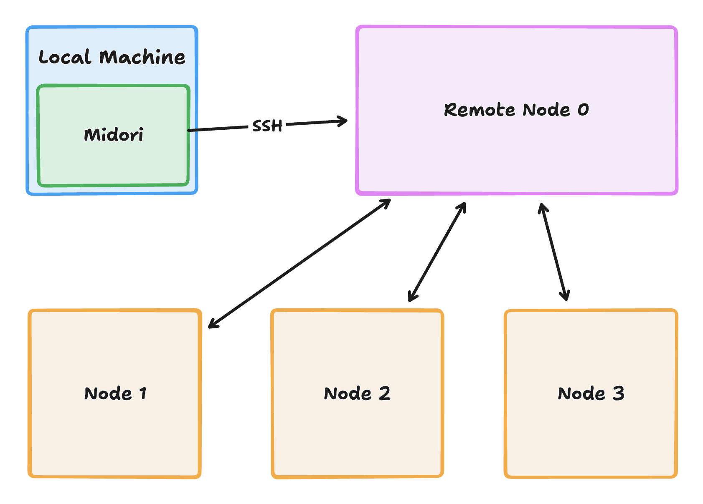

# 🍃 Midori

Midori is an orchestrator that allows researchers to run software engineering experiments on remote clusters. It is designed to be automated for time-consuming experiments that require a large number of runs.

## 🧱 Architectural

- **Why Midori?** Because there are so many things to consider when it comes to running software engineering experiments, such as:
  - Cooling down before each trial.
  - SSH Connection.
  - Randomizing the order of the trials.
  - Switching between different treatments.
  - ...
- **What is an orchestrator?** Mitori is meant to be a local tool that manipulates the remote cluster to run the experiments using SSH. In this way, the overhead of the experiment on the remote cluster is minimized.



## 🚀 Getting Started

Install Midori by running `pip install midori`. Initialize the orchestrator with the following parameters and run:

```python
from midori.core import Orchestrator

orchestrator = Orchestrator(
  hostname: str,
  username: str,
  password: str,
  repetitions: int,
  before_trial_cooling_time: int,
  trial_timespan: int,
  after_trial_cooling_time: int,
  variables: Dict[str, List[str]],
  subject_path: str,
  before_experiment_plugins: List[Type[PluginHelper]] = [],
  setup_plugins: List[Type[PluginHelper]] = [],
  end_trial_plugins: List[Type[PluginHelper]] = [],
  end_experiment_plugins: List[Type[PluginHelper]] = [],
)

orchestrator.run()
```

### Parameters

- `hostname`, `username`, `password`: Mitori needs these parameters to connect to the remote cluster via SSH.
- `repetitions`: The number of repetitions for the experiment.
- `before_trial_cooling_time`: The cooling time before each trial, in seconds.
- `trial_timespan`: The time span of each trial, in seconds.
- `after_trial_cooling_time`: The cooling time after each trial, in seconds.
- `variables`: The variables to be manipulated in the experiment. For example, if you have two variables, `x` and `y`, and you want to run the experiment with the values of `x` as `[1, 2, 3]` and the values of `y` as `[4, 5, 6]`, you can define the variables as `{'x': [1, 2, 3], 'y': [4, 5, 6]}`.
- `subject_path`: The path of the subject to be run on the remote cluster. For example, if you want to run the subject in the `~/subject` directory, you can define the path as `~/subject`.
- `before_experiment_plugins`: The plugins to be run before the experiment.
- `setup_plugins`: The plugins to be run before each trial.
- `end_trial_plugins`: The plugins to be run after each trial.
- `end_experiment_plugins`: The plugins to be run after the experiment.

## 🚧 Development and Contribution

1. Install [poetry](https://python-poetry.org/docs/#installation).
2. Navigate to the root of the project and run `poetry install`.
3. Enter the virtual environment by running `poetry shell`.
4. Run `pre-commit install` to install [pre-commit](https://pre-commit.com/) hooks.
5. Develop on `dev` branch and create a pull request to `dev` branch.
